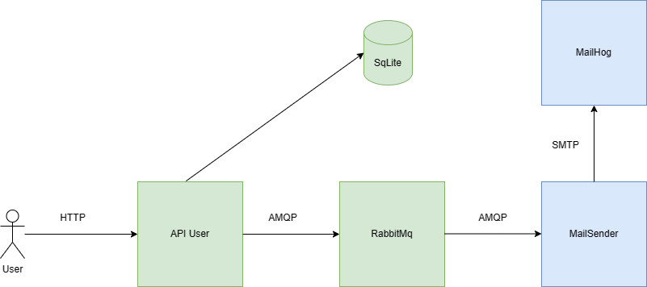
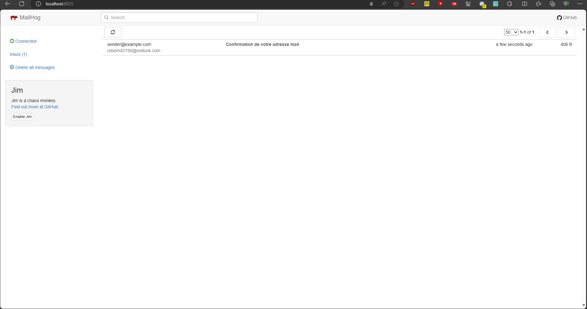

# WebService send mails

## Description du Projet

Ce web service lis dans une queue RabbitMq et envoie un mail en SMTP à une instance de Mailhog locale.

L'API va ensuite publier un message dans une queue RabbitMQ qui va ensuite être consommé par un second web service. Celui-ci va ensuite envoyer un mail à MailHog comme le montre le schéma d'architecture suivant : 



## Screenshot





## Installation

Créer un network Docker si pas déjà fait avant : 

```bash
docker network create external-network
```

Lancer Docker Compose à la racine du projet :

```bash
docker-compose up
```

Le Mailhog se trouve à l'adresse http://localhost:8025


## Auteur

Théo RAMOUSSE
